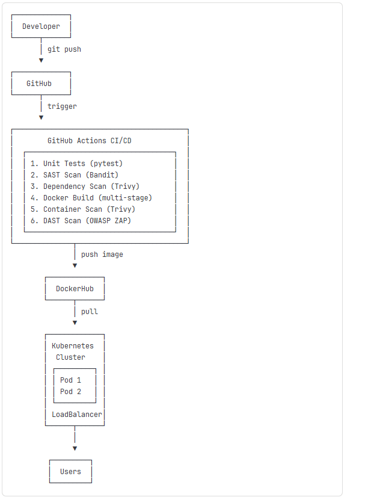

# DevOps API Project

A production-ready REST API demonstrating modern DevOps practices including CI/CD, containerization, Kubernetes orchestration, and comprehensive security scanning.

[](https://github.com/ghaliaba1/devops-api-project/actions)
[](https://hub.docker.com/r/ghaliaba1/devops-api)

---

## Table of Contents

- [Features](#-features)
- [Architecture](#-architecture)
- [Quick Start](#-quick-start)
- [API Endpoints](#-api-endpoints)
- [Testing](#-testing)
- [Deployment](#-deployment)
- [Security](#-security)
- [Troubleshooting](#-troubleshooting)

---

## Features

### Core Application
- **REST API** built with Flask
- **CRUD Operations** for items management
- **Health Check Endpoint** for monitoring
- **Prometheus Metrics** exposed at `/metrics`
- **Structured Logging** with trace IDs

### DevOps Implementation
- **6-Stage CI/CD Pipeline** with GitHub Actions
- **Multi-Stage Docker Build** for optimized images
- **Kubernetes Deployment** with 2 replicas for high availability
- **Health Probes** (liveness & readiness)
- **Resource Management** (CPU & memory limits)

### Security Scanning (4 Layers)
- **SAST** - Bandit for static code analysis
- **Dependency Scanning** - Trivy for CVE detection
- **Container Scanning** - Trivy for Docker image vulnerabilities
- **DAST** - OWASP ZAP for runtime security testing

### Production Features
- **Gunicorn** WSGI server with 2 workers
- **Health Checks** in Docker and Kubernetes
- **Auto-Scaling Ready** with HPA support
- **LoadBalancer Service** for external access

---

##  Architecture



### Technology Stack

- **Language**: Python 3.11
- **Framework**: Flask
- **WSGI Server**: Gunicorn
- **Containerization**: Docker
- **Orchestration**: Kubernetes
- **CI/CD**: GitHub Actions
- **Container Registry**: DockerHub
- **Metrics**: Prometheus (prometheus_flask_exporter)
- **Testing**: pytest, pytest-cov
- **Security**: Bandit, Trivy, OWASP ZAP

---

##  Quick Start

### Prerequisites

```bash
# Required
- Python 3.11+
- Docker
- kubectl
- Minikube (for local K8s)

# Optional
- Docker Compose
```

### Local Development

```bash
# 1. Clone repository
git clone https://github.com/ghaliaba1/devops-api-project.git
cd devops-api-project

# 2. Install dependencies
pip install -r requirements.txt

# 3. Run application
python src/app.py

# 4. Test health endpoint
curl http://localhost:5000/health
```

### Using Docker

```bash
# Build and run
docker build -t devops-api .
docker run -p 5000:5000 devops-api

# Or use Docker Compose
docker-compose up
```

### Using Kubernetes

```bash
# Deploy to cluster
kubectl apply -f k8s/deployment.yaml
kubectl apply -f k8s/service.yaml

# Check status
kubectl get pods
kubectl get svc

# Access service (Minikube)
minikube service devops-api-service
```

---

##  API Endpoints

### 1. Root Endpoint
```bash
GET /

# Example
curl http://localhost:5000/

# Response
{
  "message": "DevOps API is running",
  "version": "1.0.0"
}
```

### 2. Health Check
```bash
GET /health

# Example
curl http://localhost:5000/health

# Response
{
  "status": "healthy",
  "timestamp": "2024-11-27T21:30:00Z"
}
```

### 3. List All Items
```bash
GET /api/items

# Example
curl http://localhost:5000/api/items

# Response
{
  "items": [
    {
      "id": 1,
      "name": "Item 1",
      "description": "Description"
    }
  ],
  "count": 1
}
```

### 4. Get Single Item
```bash
GET /api/items/{id}

# Example
curl http://localhost:5000/api/items/1

# Response
{
  "id": 1,
  "name": "Item 1",
  "description": "Description"
}
```

### 5. Create Item
```bash
POST /api/items

# Example
curl -X POST http://localhost:5000/api/items \
  -H "Content-Type: application/json" \
  -d '{"name": "New Item", "description": "A new item"}'

# Response (201 Created)
{
  "id": 2,
  "name": "New Item",
  "description": "A new item"
}
```

### 6. Update Item
```bash
PUT /api/items/{id}

# Example
curl -X PUT http://localhost:5000/api/items/1 \
  -H "Content-Type: application/json" \
  -d '{"name": "Updated Item"}'

# Response
{
  "id": 1,
  "name": "Updated Item",
  "description": "Description"
}
```

### 7. Delete Item
```bash
DELETE /api/items/{id}

# Example
curl -X DELETE http://localhost:5000/api/items/1

# Response
{
  "message": "Item deleted successfully"
}
```

### 8. Prometheus Metrics
```bash
GET /metrics

# Example
curl http://localhost:5000/metrics

# Response (Prometheus format)
# HELP flask_http_request_total Total number of HTTP requests
# TYPE flask_http_request_total counter
flask_http_request_total{method="GET",status="200"} 42.0
...
```

---

##  Testing

### Run Unit Tests

```bash
# Basic test run
pytest tests/

# With verbose output
pytest tests/ -v

# With coverage report
pytest tests/ --cov=src --cov-report=term

# Generate HTML coverage report
pytest tests/ --cov=src --cov-report=html
open htmlcov/index.html
```

### Test Coverage

Current coverage: **90%+**

Covered areas:
- ✅ Health check endpoint
- ✅ CRUD operations (Create, Read, Update, Delete)
- ✅ Error handling (404, 400)
- ✅ Request logging with trace IDs
- ✅ Empty list handling
- ✅ Item validation

### Security Scanning

```bash
# Run SAST scan
bandit -r src/

# Run dependency scan
trivy fs .

# Scan Docker image
docker build -t devops-api .
trivy image devops-api

# All scans run automatically in CI/CD pipeline
```

---

## 🚢 Deployment

### CI/CD Pipeline

The pipeline runs automatically on every push to `main`:

**Stage 1: Unit Tests**
- Runs pytest with coverage
- Verifies all tests pass
- Generates coverage report

**Stage 2: SAST Scan**
- Bandit static analysis
- Checks for security vulnerabilities in code
- Continues even if issues found (reports them)

**Stage 3: Dependency Scan**
- Trivy filesystem scan
- Checks for CVEs in dependencies
- Scans `requirements.txt`

**Stage 4: Docker Build & Push**
- Multi-stage Docker build
- Tags: `1.0.{build_number}` and `sha-{git_sha}`
- Pushes to DockerHub
- Only runs on main branch

**Stage 5: Container Scan**
- Trivy scans the built Docker image
- Checks for vulnerabilities in the container
- Reports HIGH and CRITICAL issues

**Stage 6: DAST Scan**
- Starts container from built image
- OWASP ZAP baseline scan
- Tests running application for vulnerabilities

### Docker Deployment

```bash
# Pull latest image
docker pull ghaliaba1/devops-api:latest

# Run with health checks
docker run -d \
  -p 5000:5000 \
  --name devops-api \
  ghaliaba1/devops-api:latest

# Check health
docker inspect devops-api | grep -A 10 Health

# View logs
docker logs devops-api

# Stop container
docker stop devops-api
docker rm devops-api
```

### Kubernetes Deployment

```bash
# Apply manifests
kubectl apply -f k8s/deployment.yaml
kubectl apply -f k8s/service.yaml

# Verify deployment
kubectl get deployments
kubectl get pods -w

# Check service
kubectl get svc devops-api-service

# View logs
kubectl logs -l app=devops-api --tail=50

# Scale replicas
kubectl scale deployment devops-api --replicas=3

# Check pod health
kubectl describe pod <pod-name>
```

**Kubernetes Configuration:**
- **Replicas**: 2 (high availability)
- **Image**: ghaliaba1/devops-api:1.0.8
- **Resources**:
  - Requests: 128Mi memory, 100m CPU
  - Limits: 256Mi memory, 200m CPU
- **Health Probes**:
  - Liveness: 30s interval, /health endpoint
  - Readiness: 10s interval, /health endpoint
- **Service**: LoadBalancer on port 80 → 5000

---

##  Security

### Security Scanning Layers

1. **SAST (Static Application Security Testing)**
   - Tool: Bandit
   - Scans Python code for security issues
   - Checks: hardcoded passwords, SQL injection, etc.

2. **Dependency Scanning**
   - Tool: Trivy
   - Scans `requirements.txt` for known CVEs
   - Checks all Python packages

3. **Container Scanning**
   - Tool: Trivy
   - Scans Docker image layers
   - Checks base images and dependencies

4. **DAST (Dynamic Application Security Testing)**
   - Tool: OWASP ZAP
   - Tests running application
   - Checks: XSS, CSRF, injection attacks

### Security Best Practices Implemented

- ✅ Multi-stage Docker build (smaller attack surface)
- ✅ Non-root user in container
- ✅ Health checks for automatic recovery
- ✅ Resource limits prevent DoS
- ✅ Read-only root filesystem (where possible)
- ✅ Automated security scanning in CI/CD
- ✅ Regular dependency updates

---

## 🐛 Troubleshooting

### Application Won't Start

```bash
# Check if port 5000 is in use
lsof -i :5000

# Kill process if needed
kill -9 <PID>

# Check application logs
docker logs devops-api

# In Kubernetes
kubectl logs -l app=devops-api
```

### Health Checks Failing

```bash
# Test health endpoint manually
curl http://localhost:5000/health

# Check Docker container health
docker inspect devops-api | grep -A 10 Health

# In Kubernetes, check pod events
kubectl describe pod <pod-name>
kubectl get events --sort-by='.lastTimestamp'
```

### Image Pull Errors

```bash
# Verify image exists on DockerHub
docker pull ghaliaba1/devops-api:latest

# Check available tags
# Visit: https://hub.docker.com/r/ghaliaba1/devops-api/tags

# In Kubernetes, check image pull status
kubectl describe pod <pod-name> | grep -A 5 "Failed"
```

### Pods Not Ready

```bash
# Check pod status
kubectl get pods
kubectl describe pod <pod-name>

# Common causes:
# - Health probe failures
# - Insufficient resources
# - Wrong image tag
# - Image pull errors

# View detailed pod info
kubectl describe pod <pod-name>

# Check resource usage
kubectl top pods
```

### Tests Failing

```bash
# Run tests with verbose output
pytest tests/ -v

# Check specific test
pytest tests/test_app.py::test_health_check -v

# Clear pytest cache
rm -rf .pytest_cache/
pytest tests/
```

### CI/CD Pipeline Failures

```bash
# Check workflow runs on GitHub
# https://github.com/ghaliaba1/devops-api-project/actions

# Common issues:
# 1. Test failures - Check test logs
# 2. Security scan failures - Review Bandit/Trivy reports
# 3. Docker push failures - Verify DockerHub credentials
# 4. Build failures - Check Dockerfile syntax

# Re-run failed jobs in GitHub Actions UI
```

---

## 📁 Project Structure

```
devops-api-project/
├── .github/
│   └── workflows/
│       └── ci-cd.yaml          # Complete CI/CD pipeline
├── k8s/
│   ├── deployment.yaml         # Kubernetes deployment config
│   ├── service.yaml            # LoadBalancer service
│   └── servicemonitor.yaml     # Prometheus monitoring
├── src/
│   └── app.py                  # Flask application
├── tests/
│   └── test_app.py             # Unit tests
├── docker-compose.yaml         # Local development setup
├── Dockerfile                  # Multi-stage container build
├── requirements.txt            # Python dependencies
├── Makefile                    # Helper commands
├── SECURITY.md                 # Security policy
└── README.md                   # This file
```

---

##  Monitoring

### Prometheus Metrics

The `/metrics` endpoint exposes:

- **HTTP Metrics**:
  - Request count by method and status
  - Request latency histograms
  - Response size distributions

- **Python Runtime Metrics**:
  - Memory usage (heap, stack)
  - CPU usage
  - Garbage collection stats
  - Thread count

- **Custom Metrics**:
  - Item operations count
  - API endpoint usage

### Structured Logging

All requests include:
```json
{
  "timestamp": "2024-11-27T21:30:00Z",
  "level": "INFO",
  "trace_id": "abc-123",
  "method": "GET",
  "path": "/api/items",
  "status": 200,
  "duration_ms": 12.5
}
```

---

##  Development

### Adding New Endpoints

1. Add route in `src/app.py`
2. Write tests in `tests/test_app.py`
3. Run tests: `pytest tests/ -v`
4. Update this README with endpoint documentation
5. Create PR for review

### Running Locally

```bash
# Install development dependencies
pip install -r requirements.txt

# Run with auto-reload
FLASK_ENV=development python src/app.py

# Run tests in watch mode
pytest-watch tests/
```

---

##  Resources

- [GitHub Repository](https://github.com/ghaliaba1/devops-api-project)
- [DockerHub Images](https://hub.docker.com/r/ghaliaba1/devops-api)
- [CI/CD Pipeline](https://github.com/ghaliaba1/devops-api-project/actions)

### Documentation Links
- [Flask Documentation](https://flask.palletsprojects.com/)
- [Docker Best Practices](https://docs.docker.com/develop/dev-best-practices/)
- [Kubernetes Documentation](https://kubernetes.io/docs/)
- [GitHub Actions](https://docs.github.com/actions)
- [Prometheus Metrics](https://prometheus.io/docs/concepts/metric_types/)

---

## 📄 License

This project is part of a DevOps course assignment.

---

## 👤 Author

**Ghalia**
- GitHub: [@ghalia52](https://github.com/ghalia52)
- DockerHub: [ghaliaba1](https://hub.docker.com/u/ghaliaba1)

---

## 🙏 Acknowledgments

- DevOps course instructor for project requirements
- Open source community for excellent tools
- Peer reviewers for valuable feedback

---

**Last Updated**: November 2024  
**Version**: 1.0.8