# DevOps API Project

A production-ready REST API demonstrating modern DevOps practices including CI/CD, containerization, Kubernetes orchestration, comprehensive observability, and security scanning.

[](https://github.com/ghaliaba1/devops-api-project/actions)
[](https://hub.docker.com/r/ghaliaba1/devops-api)

---

## 📑 Table of Contents

- [Features](#-features)
- [Architecture](#-architecture)
- [Quick Start](#-quick-start)
- [API Endpoints](#-api-endpoints)
- [Testing](#-testing)
- [Observability](#-observability)
- [Deployment](#-deployment)
- [Security](#-security)
- [Troubleshooting](#-troubleshooting)
- [Project Structure](#-project-structure)
- [Development](#-development)

---

## ✨ Features

### Core Application
- **REST API** built with Flask
- **CRUD Operations** for items management
- **Health Check Endpoint** for monitoring
- **Prometheus Metrics** exposed at `/metrics`
- **Structured Logging** with trace IDs

### DevOps Implementation
- **6-Stage CI/CD Pipeline** with GitHub Actions
- **Multi-Stage Docker Build** for optimized images
- **Kubernetes Deployment** with 2 replicas for high availability
- **Health Probes** (liveness & readiness)
- **Resource Management** (CPU & memory limits)

### Observability (Three Pillars)
- **Metrics**: Prometheus metrics collection
- **Logs**: Structured JSON logging with trace IDs
- **Tracing**: Request tracing with X-Trace-ID headers
- **Visualization**: Grafana dashboard with real-time monitoring

### Security Scanning (4 Layers)
- **SAST** - Bandit for static code analysis
- **Dependency Scanning** - Trivy for CVE detection
- **Container Scanning** - Trivy for Docker image vulnerabilities
- **DAST** - OWASP ZAP for runtime security testing

### Production Features
- **Gunicorn** WSGI server with 2 workers
- **Health Checks** in Docker and Kubernetes
- **Auto-Scaling Ready** with HPA support
- **LoadBalancer Service** for external access

---

## 🏗️ Architecture

### System Architecture


### Observability Stack


### CI/CD Pipeline Flow

```mermaid
flowchart TD
    START([Git Push]) --> TEST{Unit Tests<br/>Pass?}
    TEST -->|No| FAIL1[❌ Pipeline Fails]
    TEST -->|Yes| SAST[SAST Scan<br/>Bandit]
    
    SAST --> DEP[Dependency Scan<br/>Trivy FS]
    
    DEP --> BUILD[Docker Build<br/>Multi-stage]
    
    BUILD --> TAG[Tag Image<br/>1.0.x & sha-xxx]
    
    TAG --> PUSH[Push to<br/>DockerHub]
    
    PUSH --> SCAN[Container Scan<br/>Trivy Image]
    
    SCAN --> DEPLOY[Deploy Container<br/>for Testing]
    
    DEPLOY --> DAST[DAST Scan<br/>OWASP ZAP]
    
    DAST --> SUCCESS([✅ Pipeline Complete])
    
    style START fill:#90EE90
    style SUCCESS fill:#90EE90
    style FAIL1 fill:#FFB6C1
    style BUILD fill:#87CEEB
    style PUSH fill:#DDA0DD
```



### Technology Stack


---

## 🚀 Quick Start

### Prerequisites

```bash
# Required
- Python 3.11+
- Docker
- kubectl
- Minikube (for local K8s)

# Optional
- Docker Compose
- Make
```

### Local Development

```bash
# 1. Clone repository
git clone https://github.com/ghalia52/devops-api-project.git
cd devops-api-project

# 2. Install dependencies
pip install -r requirements.txt

# 3. Run application
python src/app.py

# 4. Test health endpoint
curl http://localhost:5000/health
```

### Using Docker

```bash
# Build and run
docker build -t devops-api .
docker run -p 5000:5000 devops-api

# Or use Docker Compose
docker-compose up
```

### Using Kubernetes

```bash
# Deploy to cluster
kubectl apply -f k8s/deployment.yaml
kubectl apply -f k8s/service.yaml

# Check status
kubectl get pods
kubectl get svc

# Access service (Minikube)
minikube service devops-api-service
```

### Start Monitoring Stack

```bash
# Start full observability stack
make monitoring-up

# Or with docker-compose
docker-compose -f docker-compose-monitoring.yaml up -d

# Access:
# - API: http://localhost:5000
# - Prometheus: http://localhost:9090
# - Grafana: http://localhost:3000 (admin/admin)
```

---

## 🔌 API Endpoints

### Endpoint Overview

### 1. Root Endpoint
```bash
GET /

# Example
curl http://localhost:5000/

# Response
{
  "message": "DevOps API is running",
  "version": "1.0.0"
}
```

### 2. Health Check
```bash
GET /health

# Example
curl http://localhost:5000/health

# Response
{
  "status": "healthy",
  "timestamp": "2024-11-27T21:30:00Z",
  "service": "devops-api"
}
```

### 3. List All Items
```bash
GET /api/items

# Example
curl http://localhost:5000/api/items

# Response
{
  "items": [
    {
      "id": 1,
      "name": "Item 1",
      "description": "Description",
      "created_at": "2024-11-27T21:30:00Z"
    }
  ],
  "count": 1
}
```

### 4. Get Single Item
```bash
GET /api/items/{id}

# Example
curl http://localhost:5000/api/items/1

# Response
{
  "id": 1,
  "name": "Item 1",
  "description": "Description",
  "created_at": "2024-11-27T21:30:00Z"
}
```

### 5. Create Item
```bash
POST /api/items

# Example
curl -X POST http://localhost:5000/api/items \
  -H "Content-Type: application/json" \
  -d '{"name": "New Item", "description": "A new item"}'

# Response (201 Created)
{
  "id": 2,
  "name": "New Item",
  "description": "A new item",
  "created_at": "2024-11-27T21:30:00Z"
}
```

### 6. Update Item
```bash
PUT /api/items/{id}

# Example
curl -X PUT http://localhost:5000/api/items/1 \
  -H "Content-Type: application/json" \
  -d '{"name": "Updated Item", "description": "Updated"}'

# Response
{
  "id": 1,
  "name": "Updated Item",
  "description": "Updated",
  "updated_at": "2024-11-27T21:35:00Z"
}
```

### 7. Delete Item
```bash
DELETE /api/items/{id}

# Example
curl -X DELETE http://localhost:5000/api/items/1

# Response
{
  "message": "Item deleted",
  "id": 1
}
```

### 8. Prometheus Metrics
```bash
GET /metrics

# Example
curl http://localhost:5000/metrics

# Response (Prometheus format)
# HELP flask_http_request_total Total number of HTTP requests
# TYPE flask_http_request_total counter
flask_http_request_total{method="GET",status="200"} 42.0
...
```

---

## 🧪 Testing

### Run Unit Tests

```bash
# Basic test run
pytest tests/

# With verbose output
pytest tests/ -v

# With coverage report
pytest tests/ --cov=src --cov-report=term

# Generate HTML coverage report
pytest tests/ --cov=src --cov-report=html
open htmlcov/index.html
```

### Test Coverage

Current coverage: **90%+**

Covered areas:
- ✅ Health check endpoint
- ✅ CRUD operations (Create, Read, Update, Delete)
- ✅ Error handling (404, 400)
- ✅ Request logging with trace IDs
- ✅ Empty list handling
- ✅ Item validation

### Security Scanning

```bash
# Run SAST scan
bandit -r src/

# Run dependency scan
trivy fs .

# Scan Docker image
docker build -t devops-api .
trivy image devops-api

# All scans run automatically in CI/CD pipeline
```

---

## 📊 Observability

This project implements comprehensive observability with the **three pillars**: Metrics, Logs, and Tracing.

### Quick Start Monitoring Stack

```bash
# Start API + Prometheus + Grafana
make monitoring-up

# Generate test traffic
make generate-traffic

# Check status
make monitoring-status

# View logs
make monitoring-logs

# Stop monitoring
make monitoring-down
```

### Access Services

| Service | URL | Credentials |
|---------|-----|-------------|
| **API** | http://localhost:5000 | - |
| **Prometheus** | http://localhost:9090 | - |
| **Grafana** | http://localhost:3000 | admin/admin |

---

### 1. 📈 Metrics (Prometheus)

#### Exposed Metrics

The API exposes Prometheus metrics at `/metrics`:

```bash
curl http://localhost:5000/metrics
```

**Available Metrics:**

- **`flask_http_request_total`**: Total HTTP requests
  - Labels: `method`, `status`, `path`, `service`
  
- **`flask_http_request_duration_seconds`**: Request latency histogram
  - Labels: `method`, `status`, `path`
  - Buckets: 0.005s to 10s
  
- **`flask_http_request_exceptions_total`**: Total exceptions
  
- **`python_gc_objects_collected_total`**: Garbage collection stats
  
- **`python_info`**: Python runtime information

#### Sample Prometheus Queries

Access Prometheus at `http://localhost:9090` and try:

```promql
# Request rate (requests per second)
rate(flask_http_request_total[5m])

# 95th percentile response time
histogram_quantile(0.95, rate(flask_http_request_duration_seconds_bucket[5m]))

# Error rate (4xx and 5xx responses)
sum(rate(flask_http_request_total{status=~"4..|5.."}[5m]))

# Requests by endpoint
sum by (path) (flask_http_request_total)
```

#### Metrics Flow


---

### 2. 📝 Logs (Structured JSON)

#### Log Format

All requests are logged in structured JSON format with unique trace IDs:

```json
{
  "timestamp": "2024-11-27T21:30:00.123Z",
  "level": "INFO",
  "message": "Request completed",
  "method": "GET",
  "path": "/api/items",
  "status_code": 200,
  "duration_seconds": 0.012,
  "trace_id": "abc123-def456-ghi789"
}
```

#### View Logs

```bash
# View API logs
docker logs devops-api -f

# View all monitoring stack logs
make monitoring-logs

# Filter by trace ID
docker logs devops-api | grep "trace_id"

# Filter by error level
docker logs devops-api | grep "ERROR"
```

#### Log Features

- ✅ **Trace IDs**: Every request has a unique trace ID
- ✅ **Structured Format**: Easy to parse and analyze
- ✅ **Request/Response Logging**: Before and after request processing
- ✅ **Error Tracking**: Exceptions logged with full context
- ✅ **Performance Metrics**: Request duration in logs

---

### 3. 🔍 Tracing

#### Request Tracing with Trace IDs

Each request gets a unique trace ID for end-to-end tracking:

```bash
# Send request with custom trace ID
curl -H "X-Trace-ID: my-trace-123" http://localhost:5000/api/items

# Trace ID will appear in logs
docker logs devops-api | grep "my-trace-123"
```

#### Trace ID Flow


**Benefits:**
1. Correlate logs across requests
2. Debug specific user sessions
3. Track request flow through system
4. Measure end-to-end latency

---

### 4. 📊 Grafana Dashboard

#### Pre-configured Dashboard

The project includes a production-ready Grafana dashboard: **DevOps API Monitoring**

**Dashboard Panels:**


**Panel Details:**

1. **Response Time (95th Percentile)** - Time series graph
   - Shows worst-case latency for 95% of requests
   - Units: seconds
   - Thresholds: Yellow at 0.5s, Red at 1s
   - Displays: mean, max, and current values

2. **Request Rate** - Time series graph
   - Requests per second over time
   - Units: req/sec
   - Grouped by method, path, and status
   - Shows traffic patterns and spikes

3. **Status Code Distribution** - Stacked area chart
   - HTTP status codes over time
   - Color coded: 
     - 2xx = Green (success)
     - 3xx = Blue (redirects)
     - 4xx = Yellow (client errors)
     - 5xx = Red (server errors)

4. **Total Requests** - Stat panel
   - Cumulative request count
   - Large number display with trend graph
   - Shows requests in last 6 hours

#### Access Dashboard

```bash
# 1. Open Grafana
open http://localhost:3000

# 2. Login with default credentials
Username: admin
Password: admin

# 3. Navigate to dashboard
Home → Dashboards → DevOps API Monitoring
```

#### Dashboard Features

- ✅ **Auto-refresh**: Updates every 5 seconds
- ✅ **Time range selector**: Last 6 hours by default
- ✅ **Interactive legends**: Click to show/hide series
- ✅ **Tooltips**: Hover for detailed values
- ✅ **Zoom**: Click and drag to zoom time range

---

### Verification Checklist

#### ✅ Test Metrics

```bash
# 1. Check metrics endpoint
curl http://localhost:5000/metrics | grep flask_http_request_total

# 2. Verify Prometheus is scraping
curl http://localhost:9090/api/v1/targets | \
  jq '.data.activeTargets[] | select(.labels.job=="devops-api") | .health'
# Expected: "up"

# 3. Query Prometheus
curl 'http://localhost:9090/api/v1/query?query=up' | jq '.data.result'
```

#### ✅ Test Logs

```bash
# 1. Generate request
curl http://localhost:5000/health

# 2. Check structured logs
docker logs devops-api --tail 10 | grep trace_id

# 3. Verify JSON format
docker logs devops-api --tail 1 | jq .
```

#### ✅ Test Tracing

```bash
# 1. Send request with custom trace ID
curl -H "X-Trace-ID: test-trace-123" http://localhost:5000/health

# 2. Find trace ID in logs
docker logs devops-api | grep "test-trace-123"
# Should see both request and response logs
```

#### ✅ Test Grafana

```bash
# 1. Check Grafana health
curl -s http://localhost:3000/api/health | jq .

# 2. Verify Prometheus datasource
curl -u admin:admin http://localhost:3000/api/datasources | \
  jq '.[] | {name, type, url}'

# 3. List dashboards
curl -u admin:admin http://localhost:3000/api/search | \
  jq '.[] | {title, uid}'
```

---

### Monitoring Commands

```bash
# Start monitoring stack
make monitoring-up

# Check status of all services
make monitoring-status

# Generate test traffic (100 requests)
make generate-traffic

# View real-time logs
make monitoring-logs

# Stop monitoring stack
make monitoring-down

# Restart everything
make monitoring-restart

# Clean all data and volumes
make monitoring-clean
```

---

## 🚢 Deployment

### CI/CD Pipeline


The pipeline runs automatically on every push to `main`:

**Stage 1: Unit Tests**
- Runs pytest with coverage
- Verifies all tests pass
- Generates coverage report

**Stage 2: SAST Scan**
- Bandit static analysis
- Checks for security vulnerabilities in code
- Continues even if issues found (reports them)

**Stage 3: Dependency Scan**
- Trivy filesystem scan
- Checks for CVEs in dependencies
- Scans `requirements.txt`

**Stage 4: Docker Build & Push**
- Multi-stage Docker build
- Tags: `1.0.{build_number}` and `sha-{git_sha}`
- Pushes to DockerHub
- Only runs on main branch

**Stage 5: Container Scan**
- Trivy scans the built Docker image
- Checks for vulnerabilities in the container
- Reports HIGH and CRITICAL issues

**Stage 6: DAST Scan**
- Starts container from built image
- OWASP ZAP baseline scan
- Tests running application for vulnerabilities

### Docker Deployment

```bash
# Pull latest image
docker pull ghaliaba1/devops-api:latest

# Run with health checks
docker run -d \
  -p 5000:5000 \
  --name devops-api \
  ghaliaba1/devops-api:latest

# Check health
docker inspect devops-api | grep -A 10 Health

# View logs
docker logs devops-api -f

# Stop container
docker stop devops-api
docker rm devops-api
```

### Kubernetes Deployment


```bash
# Apply manifests
kubectl apply -f k8s/deployment.yaml
kubectl apply -f k8s/service.yaml

# Verify deployment
kubectl get deployments
kubectl get pods -w

# Check service
kubectl get svc devops-api-service

# View logs
kubectl logs -l app=devops-api --tail=50 -f

# Scale replicas
kubectl scale deployment devops-api --replicas=3

# Check pod health
kubectl describe pod <pod-name>
```

**Kubernetes Configuration:**
- **Replicas**: 2 (high availability)
- **Image**: ghaliaba1/devops-api:1.0.8
- **Resources**:
  - Requests: 128Mi memory, 100m CPU
  - Limits: 256Mi memory, 200m CPU
- **Health Probes**:
  - Liveness: 30s interval, /health endpoint
  - Readiness: 10s interval, /health endpoint
- **Service**: LoadBalancer on port 80 → 5000

---

## 🔒 Security

### Security Scanning Layers


1. **SAST (Static Application Security Testing)**
   - Tool: Bandit
   - Scans Python code for security issues
   - Checks: hardcoded passwords, SQL injection, etc.

2. **Dependency Scanning**
   - Tool: Trivy
   - Scans `requirements.txt` for known CVEs
   - Checks all Python packages

3. **Container Scanning**
   - Tool: Trivy
   - Scans Docker image layers
   - Checks base images and dependencies

4. **DAST (Dynamic Application Security Testing)**
   - Tool: OWASP ZAP
   - Tests running application
   - Checks: XSS, CSRF, injection attacks

### Security Best Practices Implemented

- ✅ Multi-stage Docker build (smaller attack surface)
- ✅ Non-root user in container
- ✅ Health checks for automatic recovery
- ✅ Resource limits prevent DoS
- ✅ Automated security scanning in CI/CD
- ✅ Regular dependency updates

---

## 🐛 Troubleshooting

### Application Won't Start

```bash
# Check if port 5000 is in use
lsof -i :5000

# Kill process if needed
kill -9 <PID>

# Check application logs
docker logs devops-api -f

# In Kubernetes
kubectl logs -l app=devops-api -f
```

### Health Checks Failing

```bash
# Test health endpoint manually
curl http://localhost:5000/health

# Check Docker container health
docker inspect devops-api | grep -A 10 Health

# In Kubernetes, check pod events
kubectl describe pod <pod-name>
kubectl get events --sort-by='.lastTimestamp'
```

### Monitoring Issues

```bash
# Check if Prometheus is scraping
open http://localhost:9090/targets

# Verify metrics endpoint
curl http://localhost:5000/metrics

# Check Grafana datasource
curl -u admin:admin http://localhost:3000/api/datasources

# Restart monitoring stack
make monitoring-restart
```

---

## 📁 Project Structure

```
devops-api-project/
├── .github/
│   └── workflows/
│       └── ci-cd.yaml              # CI/CD pipeline
├── k8s/
│   ├── deployment.yaml             # K8s deployment
│   ├── service.yaml                # LoadBalancer service
│   ├── grafana-deployment.yaml     # Grafana K8s deployment
│   ├── prometheus-deployment.yaml  # Prometheus K8s deployment
│   └── servicemonitor.yaml         # Prometheus service monitor
├── monitoring/
│   ├── grafana/
│   │   ├── datasources/
│   │   │   └── datasources.yaml    # Grafana datasource config
│   │   ├── dashboards/
│   │   │   └── dashboard.yaml      # Dashboard provisioning
│   │   └── dashboard-files/
│   │       └── devops-dashboard.json # Main dashboard
│   └── prometheus.yml              # Prometheus config
├── src/
│   └── app.py                      # Flask application (< 150 lines)
├── tests/
│   └── test_app.py                 # Unit tests
├── docker-compose.yaml             # Basic Docker Compose
├── docker-compose-monitoring.yaml  # Full observability stack
├── Dockerfile                      # Multi-stage container build
├── requirements.txt                # Python dependencies
├── Makefile                        # Helper commands
├── SECURITY.md                     # Security policy
└── README.md                       # This file
```

---

## 💻 Development

### Adding New Endpoints

1. Add route in `src/app.py`
2. Write tests in `tests/test_app.py`
3. Run tests: `pytest tests/ -v`
4. Update this README with endpoint documentation
5. Create PR for review

### Running Locally

```bash
# Install development dependencies
pip install -r requirements.txt

# Run with auto-reload
FLASK_ENV=development python src/app.py

# Run tests in watch mode
pytest-watch tests/
```

### Make Commands

```bash
# Development
make install              # Install dependencies
make run                  # Run application locally
make test                 # Run unit tests
make coverage             # Generate coverage report

# Docker
make build                # Build Docker image
make docker-run           # Run in Docker
make docker-stop          # Stop Docker container
make push                 # Push to DockerHub

# Kubernetes
make k8s-deploy           # Deploy to K8s
make k8s-status           # Check deployment status
make k8s-logs             # View pod logs
make k8s-delete           # Delete K8s resources

# Monitoring
make monitoring-up        # Start observability stack
make monitoring-status    # Check monitoring status
make generate-traffic     # Generate test traffic
make monitoring-logs      # View monitoring logs
make monitoring-down      # Stop monitoring stack

# Security
make security             # Run all security scans

# Cleanup
make clean                # Clean temporary files
```

---

## 📚 Resources

- [GitHub Repository](https://github.com/ghalia52/devops-api-project)
- [DockerHub Images](https://hub.docker.com/r/ghaliaba1/devops-api)
- [CI/CD Pipeline](https://github.com/ghalia52/devops-api-project/actions)

### Documentation Links
- [Flask Documentation](https://flask.palletsprojects.com/)
- [Docker Best Practices](https://docs.docker.com/develop/dev-best-practices/)
- [Kubernetes Documentation](https://kubernetes.io/docs/)
- [GitHub Actions](https://docs.github.com/actions)
- [Prometheus Metrics](https://prometheus.io/docs/concepts/metric_types/)
- [Grafana Dashboards](https://grafana.com/docs/grafana/latest/dashboards/)

---

## 📄 License

This project is part of a DevOps course assignment.

---

## 👤 Author

**Ghalia**
- GitHub: [@ghalia52](https://github.com/ghalia52)
- DockerHub: [ghaliaba1](https://hub.docker.com/u/ghaliaba1)

---

## 🙏 Acknowledgments

- DevOps course instructor for project requirements
- Open source community for excellent tools
- Peer reviewers for valuable feedback

---

**Last Updated**: January 2026  
**Version**: 1.0.8

---

## ✅ Project Status

| Component | Status | Evidence |
|-----------|--------|----------|
| Backend API | ✅ Complete | `src/app.py` (< 150 lines) |
| Unit Tests | ✅ Complete | 90%+ coverage |
| CI/CD Pipeline | ✅ Complete | 6-stage automated pipeline |
| Docker | ✅ Complete | Multi-stage build + Compose |
| Kubernetes | ✅ Complete | Deployment + Service + Probes |
| **Metrics** | ✅ Complete | Prometheus + `/metrics` endpoint |
| **Logs** | ✅ Complete | Structured JSON + Trace IDs |
| **Tracing** | ✅ Complete | X-Trace-ID header support |
| **Dashboard** | ✅ Complete | Grafana with 4 panels |
| SAST | ✅ Complete | Bandit in CI/CD |
| DAST | ✅ Complete | OWASP ZAP in CI/CD |
| Security Scans | ✅ Complete | Trivy FS + Image scans |
| Documentation | ✅ Complete | README + SECURITY.md |

**Observability Implementation**: ✅ **Fully Complete**
- Three pillars (Metrics, Logs, Tracing) all implemented
- Prometheus scraping every 10 seconds
- Grafana dashboard auto-refreshing every 5 seconds
- Structured JSON logs with unique trace IDs
- Complete monitoring stack with Docker Compose
